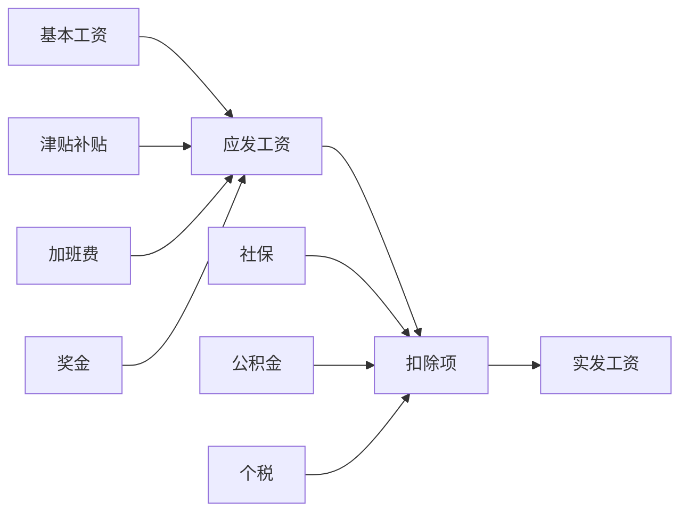

# FinancialCalculatorPro - 专业财务管理系统

<div align="center">

**作者：LYP** | [GitHub](https://github.com/lyp0746) | [邮箱](mailto:1610369302@qq.com)


**企业级专业财务管理系统 - 对标金蝶、用友等专业财务软件**

[功能特性](#-功能特性) • [安装指南](#-安装指南) • [使用说明](#-使用说明) • [技术架构](#-技术架构) • [常见问题](#-常见问题)

</div>

---

## 📋 目录

- [项目简介](#-项目简介)
- [功能特性](#-功能特性)
- [系统要求](#-系统要求)
- [安装指南](#-安装指南)
- [快速开始](#-快速开始)
- [功能模块](#-功能模块)
- [使用说明](#-使用说明)
- [技术架构](#-技术架构)
- [常见问题](#-常见问题)
- [更新日志](#-更新日志)
- [开发计划](#-开发计划)
- [贡献指南](#-贡献指南)
- [许可证](#-许可证)
- [联系方式](#-联系方式)

---

## 📖 项目简介

FinancialCalculatorPro是一款专为企业和个人设计的专业财务管理系统，提供全面的财务核算、报表生成、预算管理等功能。系统采用模块化设计，支持多账套管理，满足不同规模企业的财务管理需求。

### 设计理念

- **专业可靠**：遵循国家会计准则，确保财务数据准确合规
- **简单易用**：直观的用户界面，降低财务人员学习成本
- **功能全面**：涵盖财务核算、报表分析、预算管理等核心功能
- **扩展灵活**：模块化架构，支持企业定制化需求

### 核心优势

✅ **专业财务核算**：完整的会计科目体系和核算流程  
✅ **多维度报表**：自动生成资产负债表、利润表、现金流量表等  
✅ **智能预算管理**：支持预算编制、执行分析、差异预警  
✅ **固定资产管理**：多种折旧方法，自动计算折旧  
✅ **往来账款管理**：应收应付账款跟踪与提醒  
✅ **工资核算管理**：支持多种工资方案，自动计算个税  
✅ **成本核算分析**：项目成本、部门成本多维度分析  
✅ **发票管理系统**：发票开具、认证、台账管理  
✅ **财务分析工具**：财务比率分析、趋势分析、对比分析  
✅ **数据安全可靠**：多级权限控制，数据备份恢复机制  
✅ **多账套管理**：支持多公司、多账套独立核算  

---

## ✨ 功能特性

### 核心功能模块

| 模块 | 功能描述 | 核心特性 |
|------|---------|---------|
| 📝 **凭证管理** | 会计凭证录入、审核、查询 | • 借贷自动平衡验证<br>• 科目智能联想<br>• 批量录入<br>• 审核流程管理 |
| 📚 **账簿查询** | 总账、明细账、日记账查询 | • 多维度查询<br>• 实时账簿生成<br>• 余额自动计算<br>• 账簿导出 |
| 📊 **财务报表** | 三大报表自动生成 | • 资产负债表<br>• 利润表<br>• 现金流量表<br>• 多期对比 |
| 💰 **资金管理** | 银行账户、现金管理 | • 多账户管理<br>• 资金流水追踪<br>• 银行对账<br>• 资金预警 |
| 🏢 **固定资产** | 资产全生命周期管理 | • 资产卡片管理<br>• 多种折旧方法<br>• 自动计提折旧<br>• 资产处置 |
| 👥 **往来管理** | 应收应付管理 | • 客户供应商档案<br>• 账龄分析<br>• 收付款管理<br>• 对账单 |
| 💵 **工资管理** | 员工薪资计算 | • 自动计算个税<br>• 社保公积金<br>• 工资条生成<br>• 批量发放 |
| 📦 **成本核算** | 产品成本计算 | • 多种成本法<br>• 成本归集<br>• 成本分析<br>• 单位成本 |
| 📋 **预算管理** | 预算编制与执行 | • 预算编制<br>• 预算执行监控<br>• 差异分析<br>• 预警机制 |
| 🧾 **发票管理** | 发票登记与管理 | • 增值税发票<br>• 发票验真<br>• 发票统计<br>• 税额计算 |
| 💹 **财务分析** | 多维度财务分析 | • 比率分析<br>• 趋势分析<br>• 杜邦分析<br>• 可视化图表 |
| 🔧 **系统设置** | 基础数据配置 | • 科目设置<br>• 用户管理<br>• 权限配置<br>• 参数设置 |

### 界面特色

- **现代化UI** - 采用Material Design风格，界面美观大方
- **响应式布局** - 自适应不同分辨率屏幕
- **侧边导航** - 快速切换各功能模块
- **标签页管理** - 支持多任务并行操作
- **数据可视化** - 丰富的图表展示

### 安全特性

- **数据加密** - SQLite数据库存储，支持加密
- **操作日志** - 完整记录系统操作历史
- **备份恢复** - 一键备份/恢复数据
- **权限控制** - 多用户权限管理
- **数据导出** - 支持Excel、CSV格式导出

---

## 💻 系统要求

### 最低配置

- **操作系统**: Windows 7/10/11, macOS 10.12+, Linux (Ubuntu 18.04+)
- **处理器**: Intel Core i3 或同等级别
- **内存**: 4GB RAM
- **硬盘**: 500MB 可用空间
- **显示器**: 1366x768 分辨率

### 推荐配置

- **操作系统**: Windows 10/11 64位
- **处理器**: Intel Core i5 或更高
- **内存**: 8GB RAM 或更高
- **硬盘**: 2GB 可用空间（SSD更佳）
- **显示器**: 1920x1080 分辨率或更高

### 软件依赖

| 软件 | 版本要求 | 说明 |
|------|---------|------|
| Python | 3.7+ | 核心运行环境 |
| PyQt5 | 5.15+ | GUI框架 |
| SQLite | 3.0+ | 数据库（Python内置） |
| NumPy | 1.19+ | 数值计算 |
| Pandas | 1.1+ | 数据处理 |
| Matplotlib | 3.3+ | 数据可视化 |

---

## 📥 安装指南

### 方法一：直接运行（推荐）

#### Windows 用户

1. **安装 Python**
   ```bash
   # 下载 Python 3.9+ 
   # https://www.python.org/downloads/
   # 安装时勾选 "Add Python to PATH"
   ```

2. **安装依赖包**
   ```bash
   pip install PyQt5 numpy pandas matplotlib
   ```

3. **运行程序**
   ```bash
   python financial_calculator_pro.py
   ```

#### macOS 用户

1. **安装 Python（使用Homebrew）**
   ```bash
   brew install python@3.9
   ```

2. **安装依赖包**
   ```bash
   pip3 install PyQt5 numpy pandas matplotlib
   ```

3. **运行程序**
   ```bash
   python3 financial_calculator_pro.py
   ```

#### Linux 用户

1. **安装依赖**
   ```bash
   # Ubuntu/Debian
   sudo apt-get update
   sudo apt-get install python3 python3-pip
   
   # CentOS/RHEL
   sudo yum install python3 python3-pip
   ```

2. **安装Python包**
   ```bash
   pip3 install PyQt5 numpy pandas matplotlib
   ```

3. **运行程序**
   ```bash
   python3 financial_calculator_pro.py
   ```

### 方法二：使用虚拟环境（开发者推荐）

```bash
# 1. 创建虚拟环境
python -m venv venv

# 2. 激活虚拟环境
# Windows:
venv\Scripts\activate
# macOS/Linux:
source venv/bin/activate

# 3. 安装依赖
pip install -r requirements.txt

# 4. 运行程序
python financial_calculator_pro.py
```

### 方法三：打包成可执行文件

```bash
# 1. 安装 PyInstaller
pip install pyinstaller

# 2. 打包程序
pyinstaller --onefile --windowed --name="财务管理系统" financial_calculator_pro.py

# 3. 在 dist 目录下找到可执行文件
```

---

## 🚀 快速开始

### 第一次使用

1. **启动程序**
   - 双击运行 `financial_calculator_pro.py`
   - 系统将自动创建数据库并初始化基础数据

2. **查看工作台**
   - 启动后自动显示工作台
   - 查看各功能模块入口

3. **设置公司信息**
   - 点击 `🔧 系统设置`
   - 填写公司名称、纳税人识别号等基本信息

4. **配置会计科目**
   - 在系统设置中查看预置科目
   - 根据需要添加自定义科目

5. **录入第一张凭证**
   - 点击 `📝 凭证管理` → `➕ 新建`
   - 填写凭证信息和分录明细
   - 系统自动验证借贷平衡

### 基本操作流程


### 5分钟快速教程

#### 1️⃣ 录入凭证
```
点击左侧导航 "📝 凭证管理" → 点击 "➕ 新建" 
→ 填写凭证日期、摘要 → 添加借方和贷方分录 
→ 确认借贷平衡 → 点击 "💾 保存"
```

#### 2️⃣ 查看账簿
```
点击 "📚 账簿查询" → 选择账簿类型（总账/明细账）
→ 选择会计科目 → 设置日期范围 → 点击 "🔍 查询"
```

#### 3️⃣ 生成报表
```
点击 "📊 财务报表" → 选择报表类型（资产负债表/利润表）
→ 选择会计期间 → 点击 "🔄 刷新" → 查看报表数据
```

#### 4️⃣ 财务分析
```
点击 "💹 财务分析" → 选择分析类型（比率分析/趋势分析）
→ 输入财务数据 → 点击 "📊 分析" → 查看分析结果
```

---

## 📚 功能模块

### 1. 📝 凭证管理

#### 功能介绍
凭证管理是财务核算的基础，支持会计凭证的录入、修改、审核、查询等全流程操作。

#### 主要功能
- **新建凭证**: 支持记账、收款、付款、转账等凭证类型
- **智能录入**: 科目代码自动联想，历史摘要快速填充
- **自动平衡**: 实时计算借贷合计，自动验证平衡
- **凭证审核**: 审核流程管理，防止未审核凭证入账
- **批量操作**: 支持凭证批量导入、批量审核
- **凭证查询**: 多条件组合查询，快速定位凭证

#### 操作步骤
```
1. 点击 "📝 凭证管理" → "➕ 新建凭证"
2. 填写凭证头信息（凭证字号、日期、类型）
3. 添加分录明细：
   - 输入摘要
   - 选择会计科目
   - 输入借方或贷方金额
4. 添加多行分录，确保借贷平衡
5. 点击 "💾 保存" 或 "✓ 审核"
```

#### 注意事项
⚠️ 凭证必须借贷平衡才能保存  
⚠️ 已审核的凭证不能修改，需先取消审核  
⚠️ 制单人和审核人不能是同一人  

---

### 2. 📚 账簿查询

#### 功能介绍
提供总账、明细账、日记账、多栏账等多种账簿查询方式，实时反映账务情况。

#### 账簿类型

**总账**
- 按科目汇总显示借贷发生额和余额
- 适用于科目总体情况查询

**明细账**
- 显示科目每笔业务明细
- 包含凭证号、摘要、对方科目等信息

**日记账**
- 银行存款日记账
- 库存现金日记账

**多栏账**
- 收入、费用多栏式明细
- 便于同类科目对比分析

#### 查询技巧
```
💡 快速查询某科目余额：
   选择科目 → 设置日期范围 → 查看期末余额

💡 追溯某笔业务：
   选择明细账 → 输入关键字 → 查找相关凭证

💡 核对银行账：
   查询银行存款日记账 → 与银行对账单核对
```

---

### 3. 📊 财务报表

#### 资产负债表

**报表结构**
```
资产 = 负债 + 所有者权益

资产:
  ├─ 流动资产
  │   ├─ 货币资金
  │   ├─ 应收账款
  │   └─ 存货
  └─ 非流动资产
      ├─ 固定资产
      └─ 无形资产

负债及所有者权益:
  ├─ 流动负债
  ├─ 非流动负债
  └─ 所有者权益
```

**使用场景**
- 月末、季末、年末编制
- 评估企业财务状况
- 银行贷款资料

#### 利润表

**报表结构**
```
营业收入
- 营业成本
- 税金及附加
- 销售费用
- 管理费用
- 财务费用
+ 投资收益
= 营业利润
+ 营业外收入
- 营业外支出
= 利润总额
- 所得税费用
= 净利润
```

**使用场景**
- 分析企业盈利能力
- 成本费用控制
- 经营决策依据

#### 现金流量表

**报表结构**
- 经营活动现金流量
- 投资活动现金流量
- 筹资活动现金流量

**使用场景**
- 评估现金获取能力
- 分析现金流量结构
- 预测资金需求

---

### 4. 💰 资金管理

#### 功能清单
- ✅ 多银行账户管理
- ✅ 库存现金管理
- ✅ 资金流水记录
- ✅ 银行对账
- ✅ 资金日报表
- ✅ 资金预警

#### 操作指南

**添加银行账户**
```
1. 进入 "💰 资金管理"
2. 点击 "➕ 新增账户"
3. 填写账户信息（账户名称、开户银行、账号）
4. 设置初始余额
5. 保存
```

**记录资金流水**
```
通过凭证录入自动生成资金流水
涉及1001库存现金、1002银行存款科目的凭证
会自动更新资金流水
```

---

### 5. 🏢 固定资产

#### 折旧方法

**1. 直线法（平均年限法）**
```
月折旧额 = (原值 - 预计净残值) / 预计使用月数
```
- 适用：大部分固定资产
- 优点：计算简单，折旧均匀

**2. 双倍余额递减法**
```
年折旧率 = 2 / 预计使用年限
月折旧额 = 期初账面净值 × 年折旧率 / 12
（最后两年改用直线法）
```
- 适用：技术更新快的设备
- 优点：前期多提折旧

**3. 年数总和法**
```
年折旧率 = 尚可使用年数 / 年数总和
月折旧额 = (原值 - 预计净残值) × 年折旧率 / 12
```
- 适用：使用强度前期大的资产
- 优点：加速折旧

#### 操作流程

**新增固定资产**
```
1. 点击 "🏢 固定资产" → "➕ 新增资产"
2. 填写资产信息：
   - 资产编号（自动生成）
   - 资产名称
   - 资产类别
   - 原值
   - 购置日期
   - 使用年限
   - 折旧方法
3. 保存
```

**计提折旧**
```
1. 点击 "📊 计提折旧"
2. 选择计提月份
3. 点击 "🧮 计算折旧"
4. 查看折旧明细
5. 确认后自动生成凭证
```

---

### 6. 👥 往来管理

#### 应收账款管理

**核心功能**
- 应收登记
- 收款核销
- 账龄分析
- 催款管理
- 坏账准备

**账龄分析**
```
账龄分组：
├─ 0-30天   （正常）
├─ 31-60天  （关注）
├─ 61-90天  （催收）
├─ 91-180天 （重点催收）
└─ 180天以上（准备计提坏账）
```

**操作流程**
```
1. 新增应收：销售后登记应收账款
2. 收款录入：收到款项时核销应收
3. 账龄分析：定期查看账龄分布
4. 催款跟进：对逾期账款进行催收
```

#### 应付账款管理

**核心功能**
- 应付登记
- 付款核销
- 到期提醒
- 供应商对账

---

### 7. 💵 工资管理

#### 工资计算流程



#### 个人所得税计算

**税率表（2024年）**
| 级数 | 全月应纳税所得额 | 税率 | 速算扣除数 |
|------|----------------|------|-----------|
| 1 | 不超过3000元 | 3% | 0 |
| 2 | 3000-12000元 | 10% | 210 |
| 3 | 12000-25000元 | 20% | 1410 |
| 4 | 25000-35000元 | 25% | 2660 |
| 5 | 35000-55000元 | 30% | 4410 |
| 6 | 55000-80000元 | 35% | 7160 |
| 7 | 超过80000元 | 45% | 15160 |

**计算公式**
```
应纳税所得额 = 应发工资 - 社保公积金 - 5000（起征点）
应纳税额 = 应纳税所得额 × 税率 - 速算扣除数
实发工资 = 应发工资 - 社保公积金 - 应纳税额
```

#### 操作步骤
```
1. 维护员工信息（姓名、工号、基本工资）
2. 选择工资月份
3. 点击 "🧮 批量计算"
4. 系统自动计算各项金额
5. 核对工资数据
6. 生成工资表
7. 发放工资
```

---

### 8. 📦 成本核算

#### 成本构成

```
产品总成本 = 直接材料 + 直接人工 + 制造费用

直接材料：直接用于产品生产的原材料
直接人工：直接从事生产的工人工资
制造费用：车间管理费、折旧费、水电费等
```

#### 成本核算方法

**1. 品种法**
- 适用：大批量单步骤生产
- 特点：按产品品种归集成本

**2. 分批法**
- 适用：单件小批生产
- 特点：按批次归集成本

**3. 分步法**
- 适用：大批量多步骤生产
- 特点：按生产步骤归集成本

#### 操作指南
```
1. 进入 "📦 成本核算" → "成本录入"
2. 填写成本信息：
   - 成本单号
   - 产品名称
   - 核算期间
   - 直接材料成本
   - 直接人工成本
   - 制造费用
   - 产量
3. 系统自动计算：
   - 总成本
   - 单位成本
4. 保存
```

---

### 9. 📋 预算管理

#### 预算类型
- **收入预算**: 销售收入、其他收入
- **成本预算**: 生产成本、采购成本
- **费用预算**: 销售费用、管理费用、财务费用
- **投资预算**: 固定资产投资、项目投资

#### 预算编制流程

```
1. 确定预算期间（年度/季度/月度）
2. 各部门提交预算申请
3. 财务部门汇总审核
4. 管理层审批
5. 下达预算指标
6. 预算执行监控
7. 预算分析与调整
```

#### 预算控制

**差异分析**
```
差异 = 实际发生额 - 预算额
差异率 = 差异 / 预算额 × 100%

控制标准：
✓ 差异率 ≤ 5%  ：正常
⚠ 5% < 差异率 ≤ 10% ：关注
❌ 差异率 > 10% ：预警
```

---

### 10. 🧾 发票管理

#### 发票类型
- **增值税专用发票**: 可抵扣进项税
- **增值税普通发票**: 不可抵扣
- **电子发票**: 电子化管理

#### 发票要素
```
必填项：
├─ 发票号码
├─ 开票日期
├─ 购方信息（名称、税号）
├─ 销方信息（名称、税号）
├─ 商品名称
├─ 金额
├─ 税率
└─ 税额
```

#### 税率说明（2024年）
| 项目 | 税率 |
|------|------|
| 一般货物 | 13% |
| 农产品、图书 | 9% |
| 出口货物 | 0% |
| 服务、无形资产 | 6% |
| 小规模纳税人 | 3%（1%优惠） |

#### 操作流程
```
1. 点击 "🧾 发票管理" → "➕ 新增发票"
2. 填写发票信息
3. 输入金额和税率
4. 系统自动计算税额和价税合计
5. 保存发票记录
```

---

### 11. 💹 财务分析

#### 比率分析

**盈利能力指标**
```
毛利率 = (营业收入 - 营业成本) / 营业收入 × 100%
净利率 = 净利润 / 营业收入 × 100%
ROA = 净利润 / 总资产 × 100%
ROE = 净利润 / 净资产 × 100%
```

**偿债能力指标**
```
资产负债率 = 总负债 / 总资产 × 100%
流动比率 = 流动资产 / 流动负债 × 100%
速动比率 = (流动资产 - 存货) / 流动负债 × 100%
```

**运营能力指标**
```
总资产周转率 = 营业收入 / 平均总资产
应收账款周转率 = 营业收入 / 平均应收账款
存货周转率 = 营业成本 / 平均存货
```

#### 杜邦分析

**分析模型**
```
ROE = 销售净利率 × 总资产周转率 × 权益乘数

其中：
├─ 销售净利率 = 净利润 / 营业收入
├─ 总资产周转率 = 营业收入 / 总资产
└─ 权益乘数 = 总资产 / 所有者权益
```

**使用方法**
```
1. 进入 "💹 财务分析" → "杜邦分析"
2. 输入财务数据：
   - 净利润
   - 营业收入
   - 总资产
   - 所有者权益
3. 点击 "🔍 杜邦分析"
4. 查看分析结果和改进建议
```

---

## 🏗️ 技术架构

### 系统架构

```
┌─────────────────────────────────────┐
│         表示层 (Presentation)        │
│  PyQt5 GUI / 用户交互界面             │
├─────────────────────────────────────┤
│         业务逻辑层 (Business)         │
│  凭证管理 / 账簿生成 / 报表计算        │
├─────────────────────────────────────┤
│         数据访问层 (Data Access)      │
│  数据库操作 / 数据验证                │
├─────────────────────────────────────┤
│         数据存储层 (Storage)          │
│  SQLite 数据库                       │
└─────────────────────────────────────┘
```

### 技术栈

| 层级 | 技术 | 说明 |
|------|------|------|
| **界面层** | PyQt5 | 跨平台GUI框架 |
| **业务层** | Python 3.7+ | 核心业务逻辑 |
| **计算层** | NumPy, Pandas | 数据计算和处理 |
| **可视化** | Matplotlib | 图表绘制 |
| **数据库** | SQLite3 | 轻量级数据库 |

### 核心类设计

```python
EnhancedDatabaseManager      # 数据库管理
├─ create_all_tables()       # 创建数据表
├─ init_basic_data()         # 初始化数据
├─ execute_query()           # 查询操作
└─ execute_update()          # 更新操作

EnhancedFinancialCalculator  # 财务计算
├─ calculate_vat()           # 增值税计算
├─ calculate_corporate_tax() # 所得税计算
├─ calculate_depreciation()  # 折旧计算
├─ aging_analysis()          # 账龄分析
└─ du_pont_analysis()        # 杜邦分析

FinancialEnterpriseSystem    # 主窗口
├─ init_ui()                 # 初始化界面
├─ create_menus()            # 创建菜单
├─ create_sidebar()          # 创建侧边栏
└─ show_xxx()                # 各模块显示

VoucherDialog                # 凭证对话框
├─ add_line()                # 添加分录
├─ calculate_totals()        # 计算合计
└─ save_voucher()            # 保存凭证
```

### 数据库设计

**核心数据表**
- `accounts` - 会计科目表
- `vouchers` - 凭证主表
- `voucher_details` - 凭证明细表
- `customers` - 客户信息表
- `suppliers` - 供应商信息表
- `fixed_assets` - 固定资产表
- `receivables` - 应收账款表
- `payables` - 应付账款表
- `employees` - 员工信息表
- `salaries` - 工资表
- `costs` - 成本表
- `budgets` - 预算表
- `invoices` - 发票表
- `system_logs` - 系统日志表

---

## ❓ 常见问题

### 安装问题

**Q1: 提示"ModuleNotFoundError: No module named 'PyQt5'"**
```bash
A: 需要安装PyQt5
pip install PyQt5
```

**Q2: Windows下中文显示乱码**
```bash
A: 设置系统环境变量
set PYTHONIOENCODING=utf-8
```

**Q3: macOS提示"pyqt5 not found"**
```bash
A: 使用pip3安装
pip3 install PyQt5
```

### 使用问题

**Q4: 凭证保存失败，提示借贷不平衡**
```
A: 检查借方合计和贷方合计是否相等
   借方合计 = 贷方合计（精确到分）
```

**Q5: 如何导入已有账套数据？**
```
A: 方法1：使用"导入数据"功能，支持Excel格式
   方法2：使用"恢复数据"功能，恢复备份的数据库文件
```

**Q6: 如何修改已审核的凭证？**
```
A: 已审核凭证需要先"取消审核"才能修改
   操作：选中凭证 → 右键 → 取消审核 → 修改 → 重新审核
```

**Q7: 折旧计算结果与预期不符**
```
A: 检查以下设置：
   1. 原值是否正确
   2. 使用年限是否正确
   3. 折旧方法是否选择正确
   4. 已使用月数是否准确
```

**Q8: 如何生成年度财务报表？**
```
A: 选择报表类型 → 设置期间为"年初至年末" → 刷新
   例如：2024年度报表，期间选择2024-01-01至2024-12-31
```

### 数据安全

**Q9: 如何备份数据？**
```
A: 文件 → 备份数据 → 选择保存位置 → 确定
   建议：每周备份一次，重要操作前备份
```

**Q10: 误删除数据如何恢复？**
```
A: 文件 → 恢复数据 → 选择备份文件 → 确定
   注意：恢复操作会覆盖当前数据
```

### 性能优化

**Q11: 数据量大时查询缓慢**
```
A: 优化方法：
   1. 缩小查询日期范围
   2. 使用精确科目查询而非模糊查询
   3. 定期清理历史数据
   4. 考虑升级硬件（使用SSD）
```

**Q12: 程序启动慢**
```
A: 可能原因：
   1. 数据库文件过大 → 定期清理归档
   2. 系统资源不足 → 关闭其他程序
   3. 病毒软件干扰 → 添加信任白名单
```

---

## 📝 更新日志

### Version 2.0.0 (2024-01-15)

#### 🎉 新功能
- ✨ 全新的现代化UI设计
- ✨ 增加固定资产管理模块
- ✨ 增加工资管理模块
- ✨ 增加成本核算模块
- ✨ 增加预算管理模块
- ✨ 增加发票管理模块
- ✨ 增加财务分析模块（杜邦分析、比率分析）
- ✨ 支持多用户权限管理
- ✨ 增加系统日志记录

#### 🔧 改进
- 🚀 优化凭证录入界面，支持科目快速搜索
- 🚀 提升报表生成速度
- 🚀 改进数据库查询性能
- 🚀 优化内存占用

#### 🐛 修复
- 🔨 修复凭证审核后无法撤销的问题
- 🔨 修复账簿余额计算错误
- 🔨 修复报表导出格式问题
- 🔨 修复日期选择器的显示问题

### Version 1.5.0 (2023-09-01)

#### 新增
- 往来管理模块
- 账龄分析功能
- 数据导入导出

#### 改进
- 优化界面布局
- 提升系统稳定性

### Version 1.0.0 (2023-06-01)

#### 初始版本
- 凭证管理
- 账簿查询
- 财务报表
- 资金管理

---

## 🗓️ 开发计划

### V2.1.0 (计划中)

#### 新功能
- [ ] 移动端APP（Android/iOS）
- [ ] 云端数据同步
- [ ] 智能凭证录入（OCR识别）
- [ ] 语音录入
- [ ] 多公司账套管理
- [ ] 税务申报集成

#### 优化
- [ ] 报表模板自定义
- [ ] 批量打印凭证
- [ ] 更多财务分析模型
- [ ] 数据可视化看板

### V3.0.0 (规划中)

#### 重大更新
- [ ] Web版本（B/S架构）
- [ ] 多人协同操作
- [ ] 工作流引擎
- [ ] BI商业智能
- [ ] 人工智能财务助手

---

## 🤝 贡献指南

### 如何贡献

我们欢迎任何形式的贡献！

#### 报告Bug
1. 在 GitHub Issues 中搜索是否已有相同问题
2. 如果没有，创建新的 Issue
3. 详细描述问题（操作步骤、预期结果、实际结果）
4. 附上截图或日志

#### 提交代码
1. Fork 本仓库
2. 创建新分支 (`git checkout -b feature/AmazingFeature`)
3. 提交更改 (`git commit -m 'Add some AmazingFeature'`)
4. 推送到分支 (`git push origin feature/AmazingFeature`)
5. 创建 Pull Request

#### 代码规范
- 遵循 PEP 8 编码规范
- 添加必要的注释
- 编写单元测试
- 更新相关文档

### 开发环境搭建

```bash
# 1. 克隆仓库
git clone https://github.com/yourusername/financial-calculator-pro.git
cd financial-calculator-pro

# 2. 创建虚拟环境
python -m venv venv
source venv/bin/activate  # Windows: venv\Scripts\activate

# 3. 安装开发依赖
pip install -r requirements-dev.txt

# 4. 运行测试
pytest tests/

# 5. 运行程序
python financial_calculator_pro.py
```

---

## 📄 许可证

本项目采用 **MIT License** 开源协议

```
MIT License

Copyright (c) 2024 FinancialCalculatorPro

Permission is hereby granted, free of charge, to any person obtaining a copy
of this software and associated documentation files (the "Software"), to deal
in the Software without restriction, including without limitation the rights
to use, copy, modify, merge, publish, distribute, sublicense, and/or sell
copies of the Software, and to permit persons to whom the Software is
furnished to do so, subject to the following conditions:

The above copyright notice and this permission notice shall be included in all
copies or substantial portions of the Software.

THE SOFTWARE IS PROVIDED "AS IS", WITHOUT WARRANTY OF ANY KIND, EXPRESS OR
IMPLIED, INCLUDING BUT NOT LIMITED TO THE WARRANTIES OF MERCHANTABILITY,
FITNESS FOR A PARTICULAR PURPOSE AND NONINFRINGEMENT. IN NO EVENT SHALL THE
AUTHORS OR COPYRIGHT HOLDERS BE LIABLE FOR ANY CLAIM, DAMAGES OR OTHER
LIABILITY, WHETHER IN AN ACTION OF CONTRACT, TORT OR OTHERWISE, ARISING FROM,
OUT OF OR IN CONNECTION WITH THE SOFTWARE OR THE USE OR OTHER DEALINGS IN THE
SOFTWARE.
```

---

## 📞 联系方式

### 技术支持

- **Email**: QQ邮箱：1610369302@qq.com
- **GitHub Issues**: [提交问题](https://github.com/lyp0746)
- **官方网站**: https://github.com/lyp0746
- **用户手册**: https://github.com/lyp0746

### 社区交流

- **QQ群**: 
- **微信公众号**: 
- **知乎专栏**: 

### 商务合作

- **企业定制**: 
- **技术咨询**: 

---

## 🙏 致谢

感谢以下开源项目：

- [Python](https://www.python.org/) - 核心语言
- [PyQt5](https://www.riverbankcomputing.com/software/pyqt/) - GUI框架
- [NumPy](https://numpy.org/) - 数值计算
- [Pandas](https://pandas.pydata.org/) - 数据处理
- [Matplotlib](https://matplotlib.org/) - 数据可视化
- [SQLite](https://www.sqlite.org/) - 数据库引擎

感谢所有贡献者和用户的支持！

---

## ⭐ Star History

如果这个项目对您有帮助，请给我们一个 Star！⭐

[](https://star-history.com/#yourusername/financial-calculator-pro&Date)

---

<div align="center">

**Made with ❤️ by FinancialCalculatorPro Team**

[官网](https://www.financialpro.com) • [文档](https://docs.financialpro.com) • [社区](https://community.financialpro.com)

Copyright © 2024 FinancialCalculatorPro. All rights reserved.

</div>